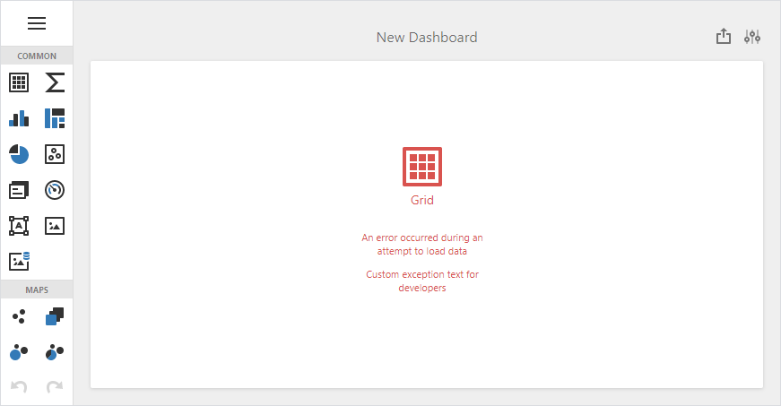

# ASP.NET MVC Dashboard - How to specify custom exception text
<!-- run online -->
**[[Run Online]](https://codecentral.devexpress.com/267336836/)**
<!-- run online end -->

The dashboard in this project contains invalid data connection. This example shows how to override the [OnException](https://docs.microsoft.com/en-us/dotnet/api/system.web.mvc.controller.onexception) method in the custom dashboard controller to specify custom text in the exception. The exception occurs when a controller tries to load data.



Create a custom dashboard controller and override the `OnException` method. The displayed text depends on whether the application is in development mode:

```cs
public class CustomDashboardController : DashboardController {
	protected override void OnException(ExceptionContext context) {
		var exception = context.Exception;
		if(exception != null && context.HttpContext != null) {
			var response = context.HttpContext.Response;
			response.StatusCode = (int)HttpStatusCode.BadRequest;

			response.ContentType = "application/json";
			// The 'mode' attribute in the 'customErrors' section of the Web.config file specifies whether an application is in development mode.
			bool isCustomErrorsEnabled = System.Web.HttpContext.Current != null ? System.Web.HttpContext.Current.IsCustomErrorEnabled : true;

			response.Write(GetJson(isCustomErrorsEnabled ? "Custom exception text for end users" : "Custom exception text for developers"));

			context.ExceptionHandled = true;
		}
	}

	static string GetJson(string message) {
		return $"{{ \"Message\":\"{message}\" }}";
	}
}

public class CustomException : Exception {
	public const string SafeMessage = "Safe Message!";
	public const string UnsafeMessage = "Unsafe Message!";
}
```

Use the created `CustomDashboard` controller when you map a dashboard route:

```cs
public static void RegisterService(RouteCollection routes) {
	routes.MapDashboardRoute("dashboardDesigner", "CustomDashboard", new string[] { "MvcDashboardOverrideOnException" });
}
```
