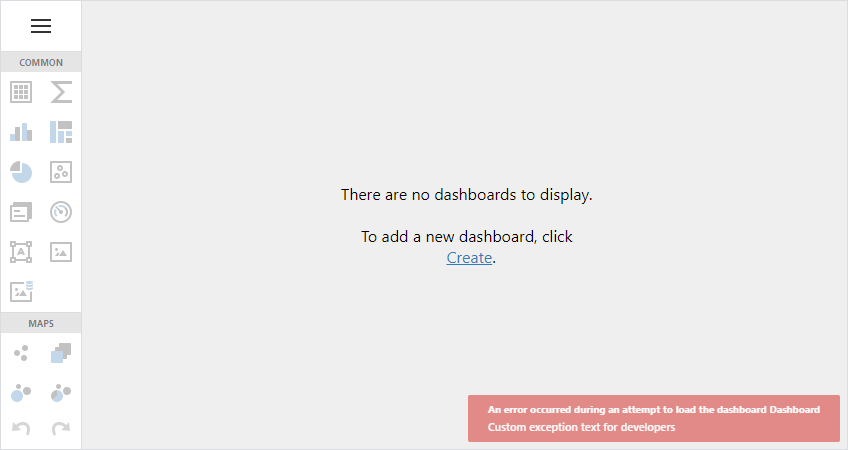

# ASP.NET MVC Dashboard - How to handle errors

The following example demostrates two approaches on how to handle errors in the MVC Dashboard applicaiton:

- How to specify custom text for internal Dashboard errors
- How to throw a custom exception during a server-side processing and display the error in the Dashboard error toast

> Both projects in this example override the [OnException](https://docs.microsoft.com/en-us/dotnet/api/system.web.mvc.controller.onexception) method. You can also handle the [ASPxWebControl.CallbackError](https://docs.devexpress.com/AspNet/DevExpress.Web.ASPxWebControl.CallbackError) event to customize error text. See the following example for details about this approach: [ASP.NET Web Forms Dashboard - How to handle errors](https://github.com/DevExpress-Examples/asp-net-web-forms-dashboard-change-default-error-text-callback-error)

## How to specify custom text for internal Dashboard errors

<!-- default file list -->
*Files to look at*:
* [Global.asax.cs](./CS/MvcCustomTextForInternalDashboardErrors/Global.asax.cs) (VB: [Global.asax.vb](./VB/MvcCustomTextForInternalDashboardErrors/Global.asax.vb))
* [CustomDashboardController.cs](./CS/MvcCustomTextForInternalDashboardErrors/Controllers/CustomDashboardController.cs) (VB: [CustomDashboardController.vb](./VB/MvcCustomTextForInternalDashboardErrors/Controllers/CustomDashboardController.vb))
* [DashboardConfig.cs](./CS/MvcCustomTextForInternalDashboardErrors/App_Start/DashboardConfig.cs) (VB: [DashboardConfig.vb](./VB/MvcCustomTextForInternalDashboardErrors/App_Start/DashboardConfig.vb))
* [Index.cshtml](./CS/MvcCustomTextForInternalDashboardErrors/Views/Default/Index.cshtml) VB: [Index.vbhtml](./VB/MvcCustomTextForInternalDashboardErrors/Views/Default/Index.vbhtml))
<!-- default file list end -->

The dashboard in this project contains invalid data connection. This example shows how to override the [OnException](https://docs.microsoft.com/en-us/dotnet/api/system.web.mvc.controller.onexception) method in a custom dashboard controller to specify custom text in the exception. The exception occurs when the controller tries to load data.


Create a custom dashboard controller and override the `OnException` method. The displayed text depends on whether the application is in development mode:

```cs
public class CustomDashboardController : DashboardController
{
	protected override void OnException(ExceptionContext context) {
		var exception = context.Exception;
		if(exception != null && context.HttpContext != null) {
			var response = context.HttpContext.Response;
			response.StatusCode = (int)HttpStatusCode.BadRequest;

			response.ContentType = "application/json";
			// The 'mode' attribute in the 'customErrors' section of the Web.config file specifies whether an application is in development mode.
			bool isCustomErrorsEnabled = System.Web.HttpContext.Current != null ? System.Web.HttpContext.Current.IsCustomErrorEnabled : true;

			response.Write(GetJson(isCustomErrorsEnabled ? "Custom exception text for end users" : "Custom exception text for developers"));

			context.ExceptionHandled = true;
		}
	}

	static string GetJson(string message) {
		return $"{{ \"Message\":\"{message}\" }}";
	}
}
```

Specify the created custom controller's name in the view:

```html
<body>
    <div style="position:absolute; top: 0; right:0; left:0; bottom: 0">
        @Html.DevExpress().Dashboard(settings => {
            settings.ControllerName = "CustomDashboard";
            settings.Name = "Dashboard";
            settings.Width = Unit.Percentage(100);
            settings.Height = Unit.Percentage(100);
        }).GetHtml()
    </div>
</body>
```

Use the created `CustomDashboard` controller when you map a dashboard route:

```cs
public static void RegisterService(RouteCollection routes) {
	routes.MapDashboardRoute("dashboardDesigner", "CustomDashboard", new string[] { "MvcDashboardOverrideOnException" });
}
```

## How to throw a custom exception during a server-side processing and display the error in the Dashboard error toast

<!-- default file list -->
*Files to look at*:
* [Global.asax.cs](./CS/MvcThrowCustomExceptionDashboardErrorToast/Global.asax.cs) (VB: [Global.asax.vb](./VB/MvcThrowCustomExceptionDashboardErrorToast/Global.asax.vb))
* [DashboardConfig.cs](./CS/MvcThrowCustomExceptionDashboardErrorToast/App_Start/DashboardConfig.cs) (VB: [DashboardConfig.vb](./VB/MvcThrowCustomExceptionDashboardErrorToast/App_Start/DashboardConfig.vb))
* [CustomDashboardController.cs](./CS/MvcThrowCustomExceptionDashboardErrorToast/Controllers/CustomDashboardController.cs) (VB: [CustomDashboardController.vb](./VB/MvcThrowCustomExceptionDashboardErrorToast/Controllers/CustomDashboardController.vb))
* [Index.cshtml](./CS/MvcThrowCustomExceptionDashboardErrorToast/Views/Default/Index.cshtml) (VB: [Index.vbhtml](./VB/MvcThrowCustomExceptionDashboardErrorToast/Views/Default/Index.vbhtml))
<!-- default file list end -->

This example shows how to throw a custom exception when a controller loads a dashboard and display this exception in the dashboard error toast. The example overrides the [OnException](https://docs.microsoft.com/en-us/dotnet/api/system.web.mvc.controller.onexception) method.



Create a custom dashboard controller and override the `OnException` method. The displayed text depends on whether the application is in development mode:

```cs
public class CustomDashboardController : DashboardController {
	protected override void OnException(ExceptionContext context) {
		var exception = context.Exception;
		if(exception != null && context.HttpContext != null) {
			var response = context.HttpContext.Response;
			response.StatusCode = (int)HttpStatusCode.BadRequest;
			response.ContentType = "application/json";

			//CustomException customException = exception as CustomException;
			bool isCustomErrorsEnabled = System.Web.HttpContext.Current != null ? System.Web.HttpContext.Current.IsCustomErrorEnabled : true;
			response.Write(GetJson(isCustomErrorsEnabled ? "Custom exception text for end users" : "Custom exception text for developers"));
			//string message = customException != null ? (isCustomErrorsEnabled ? CustomException.SafeMessage : CustomException.UnsafeMessage) : "";
			//response.Write(GetJson(message));

			context.ExceptionHandled = true;
		}
	}

	static string GetJson(string message) {
		return $"{{ \"Message\":\"{message}\" }}";
	}
}
```

Specify the created custom controller's name in the view:

```html
<body>
    <div style="position:absolute; top: 0; right:0; left:0; bottom: 0">
        @Html.DevExpress().Dashboard(settings => {
            settings.ControllerName = "CustomDashboard";
            settings.Name = "Dashboard";
            settings.Width = Unit.Percentage(100);
            settings.Height = Unit.Percentage(100);
        }).GetHtml()
    </div>
</body>
```

Use the created `CustomDashboard` controller when you map a dashboard route:

```cs
public static void RegisterService(RouteCollection routes) {
	routes.MapDashboardRoute("dashboardDesigner", "CustomDashboard", new string[] { "MvcDashboardOnException" });
}
```

To throw an exception when the control loads a dashboard, create custom dashboard storage and override the `LoadDashboard` method:

```cs
public class CustomDashboardStorage : IDashboardStorage {
	IEnumerable<DashboardInfo> IDashboardStorage.GetAvailableDashboardsInfo() {
		return new[] {
			new DashboardInfo { ID = "Dashboard", Name = "Dashboard" }
		};
	}
	XDocument IDashboardStorage.LoadDashboard(string dashboardID) {
		throw new CustomException();
	}
	void IDashboardStorage.SaveDashboard(string dashboardID, XDocument dashboard) {
	}
}
```

## Documentation

- [Error Logging in Web Dashboard](https://docs.devexpress.com/Dashboard/400015/web-dashboard/error-logging)

## More Examples

- [ASP.NET Web Forms Dashboard - How to handle errors](https://github.com/DevExpress-Examples/asp-net-web-forms-dashboard-change-default-error-text-callback-error)
- [ASP.NET Core Dashboard - How to handle errors](https://github.com/DevExpress-Examples/asp-net-core-dashboard-change-default-error-text-exception-filter)